# Module 9 - AWS Services

This repository contains a demo project created as part of my **DevOps studies** in the **TechWorld with Nana – DevOps Bootcamp**.

https://www.techworld-with-nana.com/devops-bootcamp

***Demo Project:*** Interacting with AWS CLI

***Technologies used:*** AWS, Linux

***Project Description:***

- Install & configure AWS CLI to connect to our AWS account
- Create EC2 Instance using AWS CLI with all configurations like Security Group
- Create SSH key pair
- Create IAM resources like User, Group, Policy using the AWS CLI
- List and browse AWS resources using the AWS CLI

---

## 1. Install & Configure AWS CLI

AWS CLI installation documentation: https://docs.aws.amazon.com/cli/latest/userguide/getting-started-install.html

**Configure the AWS CLI with a named profile:**

```sh
aws configure --profile admin
```

Enter the credentials from the downloaded `.csv` for the admin account:

```
AWS Access Key ID [None]:     <from csv>
AWS Secret Access Key [None]: <from csv>
Default region name [None]:   <region>       # e.g. us-east-1
Default output format [None]: json
```

---

## 2. Create an EC2 Instance via AWS CLI

### 2.1 Grab VPC ID

```sh
aws ec2 describe-vpcs --profile admin
```

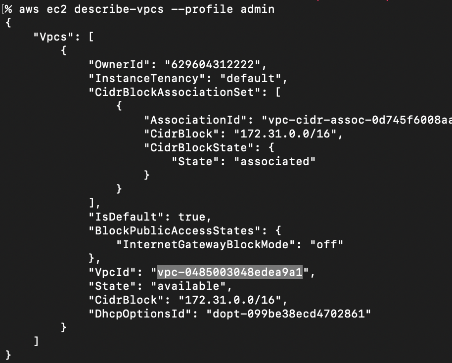

### 2.2 Create Security Group

```sh
aws ec2 create-security-group \
  --profile admin \
  --group-name app-96-sg \
  --description "SG App 96" \
  --vpc-id "<YOUR_VPC_ID>"
```

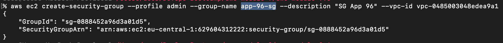

### 2.3 Add Security Group Rules (SSH Access)

Grab your public IP:

```sh
curl ipinfo.io/ip
```

Allow SSH from your IP only:

```sh
aws ec2 authorize-security-group-ingress \
  --profile admin \
  --group-id "<YOUR_GROUP_ID>" \
  --protocol tcp \
  --port 22 \
  --cidr "<YOUR_IP>/32"
```

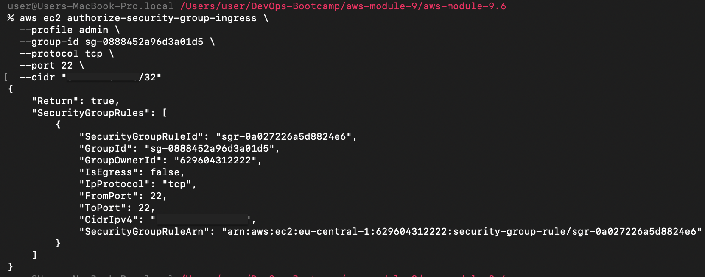

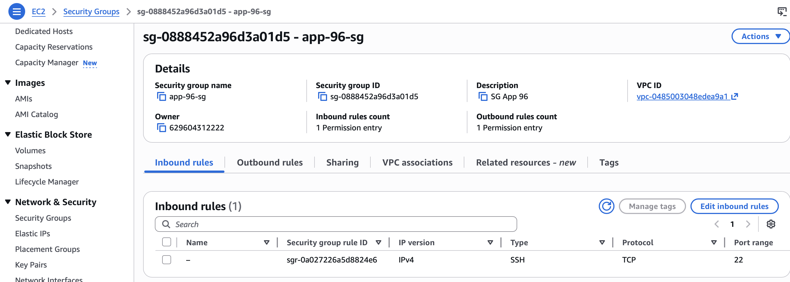

### 2.4 Create Key Pair

```sh
aws ec2 create-key-pair \
  --profile admin \
  --key-name app-96-key \
  --query "KeyMaterial" \
  --output text > app-96-key.pem
```

### 2.5 Get Subnet ID

```sh
aws ec2 describe-subnets --profile admin
```

Use the `SubnetId` from the `euc1-az1` availability zone.

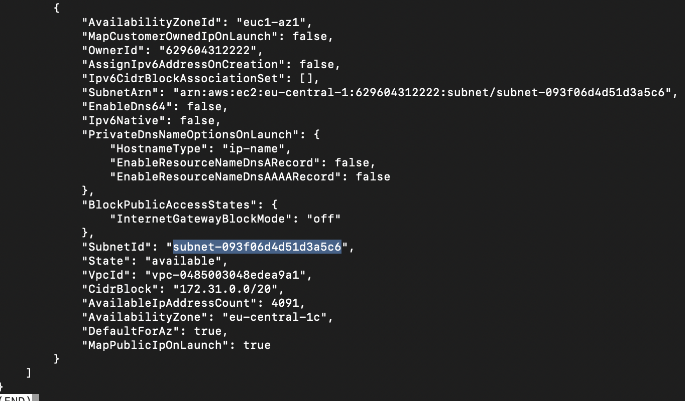

### 2.6 Get AMI ID

Go to **EC2 → Images → AMI Catalog** and search for the desired Amazon Linux image.

> **Note:** AMI IDs are region-specific. The example below is for `eu-central-1`.

Image ID: `ami-096a4fdbcf530d8e0`

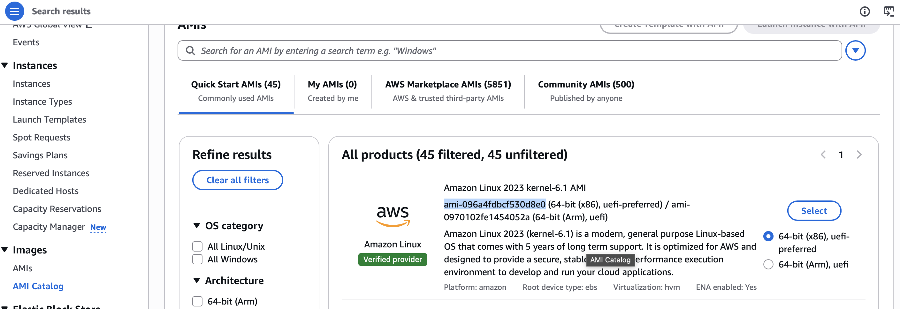

### 2.7 Launch Instance

```sh
aws ec2 run-instances \
  --profile admin \
  --image-id <YOUR_AMI_ID> \
  --count 1 \
  --instance-type t2.micro \
  --key-name app-96-key \
  --security-group-ids <YOUR_SECURITY_GROUP_ID> \
  --subnet-id <YOUR_SUBNET_ID>
```

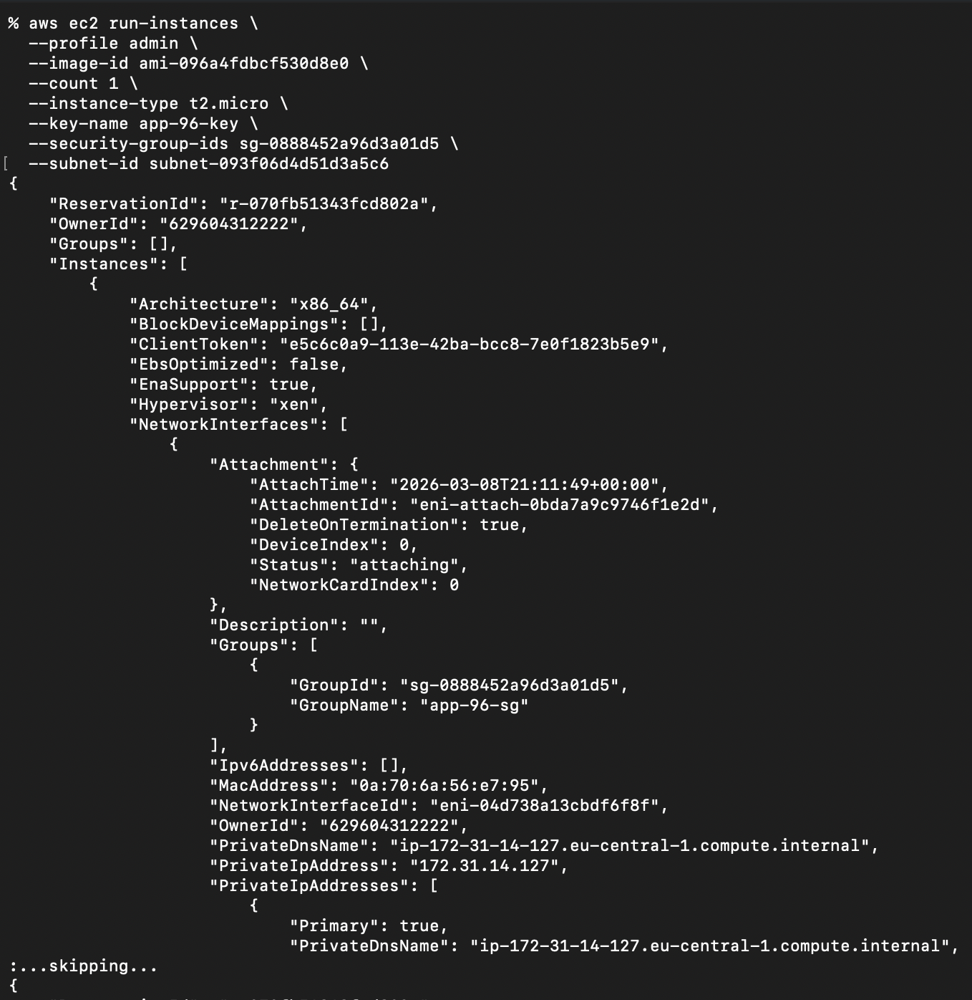

### 2.8 Connect to the Instance

Get the instance's public IP:

```sh
aws ec2 describe-instances --profile admin
```

Restrict access to the key file and connect via SSH:

```sh
chmod 400 app-96-key.pem
ssh -i app-96-key.pem ec2-user@<YOUR_INSTANCE_IP>
```

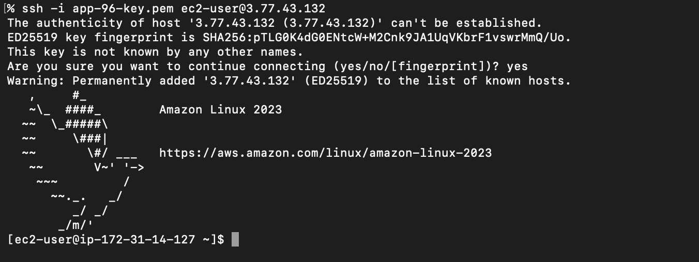

---

## 3. Create IAM Resources via AWS CLI

### 3.1 Create a Group

```sh
aws iam create-group --group-name group-cli --profile admin
```

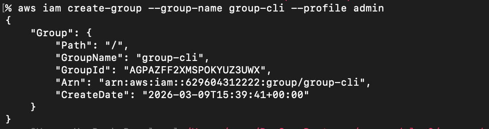

### 3.2 Create a User

```sh
aws iam create-user --user-name user-cli --profile admin
```

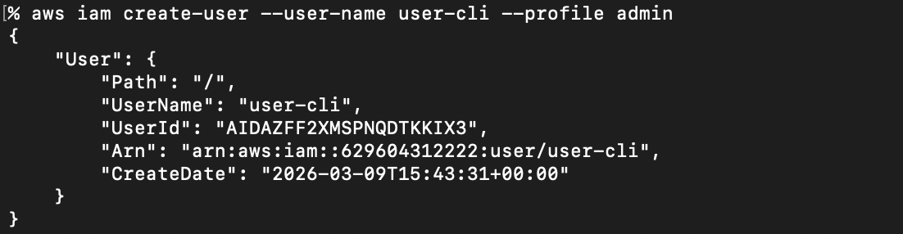

### 3.3 Add User to the Group

```sh
aws iam add-user-to-group \
  --user-name user-cli \
  --group-name group-cli \
  --profile admin
```

Verify the user belongs to the group:

```sh
aws iam get-group --group-name group-cli --profile admin
```

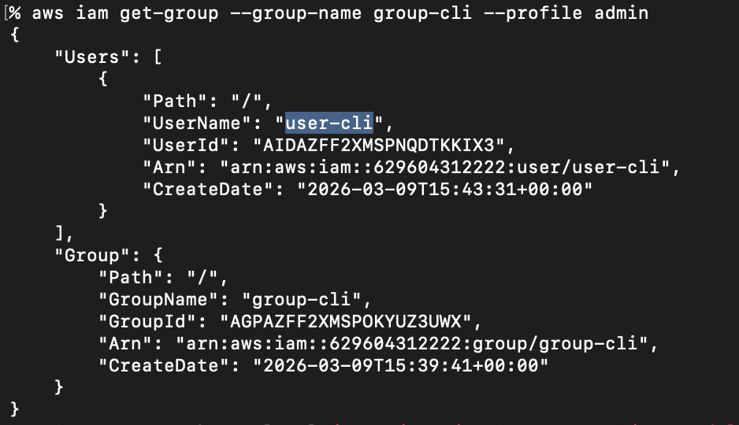

### 3.4 Attach a Policy to the Group

Grab the `AmazonEC2FullAccess` policy ARN:

- **Option A — AWS Console:** Go to **IAM → Policies**, search for `AmazonEC2FullAccess`, and copy the ARN.

- **Option B — AWS CLI:**

```sh
aws iam list-policies \
  --query 'Policies[?PolicyName==`AmazonEC2FullAccess`].Arn' \
  --output text \
  --profile admin
```

ARN: `arn:aws:iam::aws:policy/AmazonEC2FullAccess`

Attach the policy to the group:

```sh
aws iam attach-group-policy \
  --group-name group-cli \
  --policy-arn arn:aws:iam::aws:policy/AmazonEC2FullAccess \
  --profile admin
```

Verify the policy is attached:

```sh
aws iam list-attached-group-policies --group-name group-cli --profile admin
```

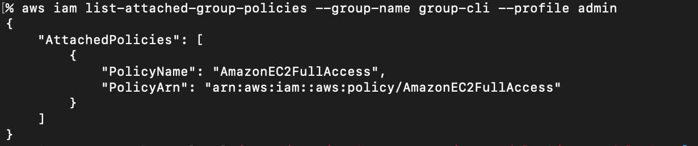

### 3.5 Create Login Credentials for the User

Assign a temporary password (user must reset on first login):

```sh
aws iam create-login-profile \
  --user-name user-cli \
  --password P@ssw0rd \
  --password-reset-required \
  --profile admin
```

### 3.6 Create and Attach a ChangePassword Policy

Create a policy that allows users to change their own password. See [password-policy.json](./password-policy.json) for the policy document.

```sh
aws iam create-policy \
  --policy-name ChangePassword \
  --policy-document file://password-policy.json \
  --profile admin
```

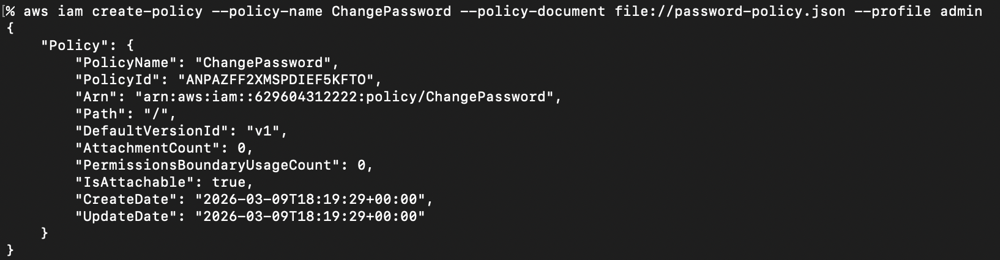

Attach the new policy to the group (use the ARN returned by the previous command):

```sh
aws iam attach-group-policy \
  --group-name group-cli \
  --policy-arn <CHANGE_PASSWORD_POLICY_ARN> \
  --profile admin
```

Log in as `user-cli` and reset the password when prompted:

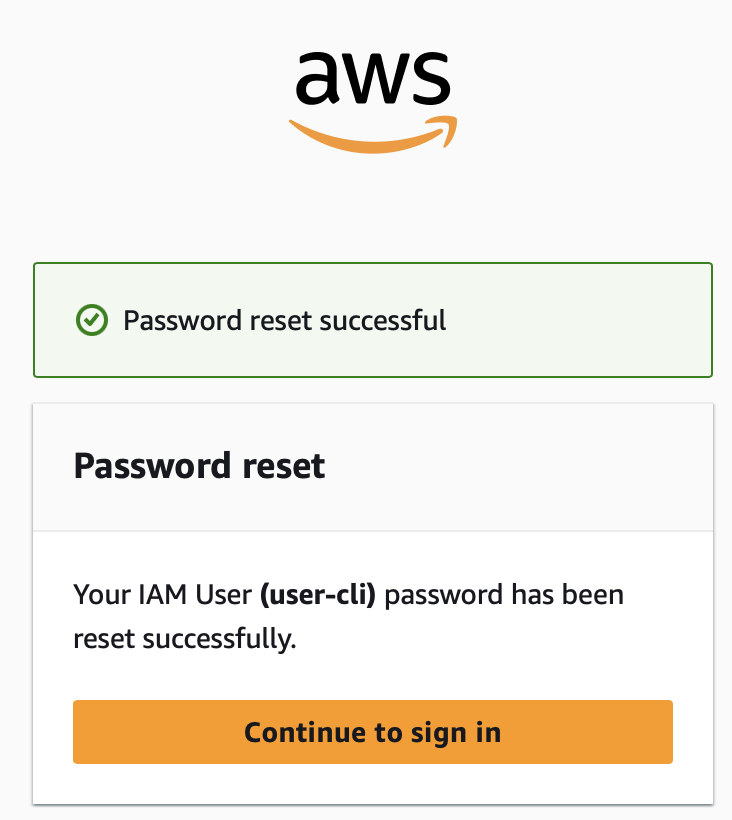

### 3.7 Create Programmatic Access Keys

```sh
aws iam create-access-key --user-name user-cli --profile admin
```

Set the returned credentials as environment variables to use `user-cli` as the default identity:

```sh
export AWS_ACCESS_KEY_ID=<AccessKeyId>
export AWS_SECRET_ACCESS_KEY=<SecretAccessKey>
export AWS_DEFAULT_REGION=<your-region>   # e.g. us-east-1
```

Verify the access keys work (EC2 is permitted):

```sh
aws ec2 describe-instances
```

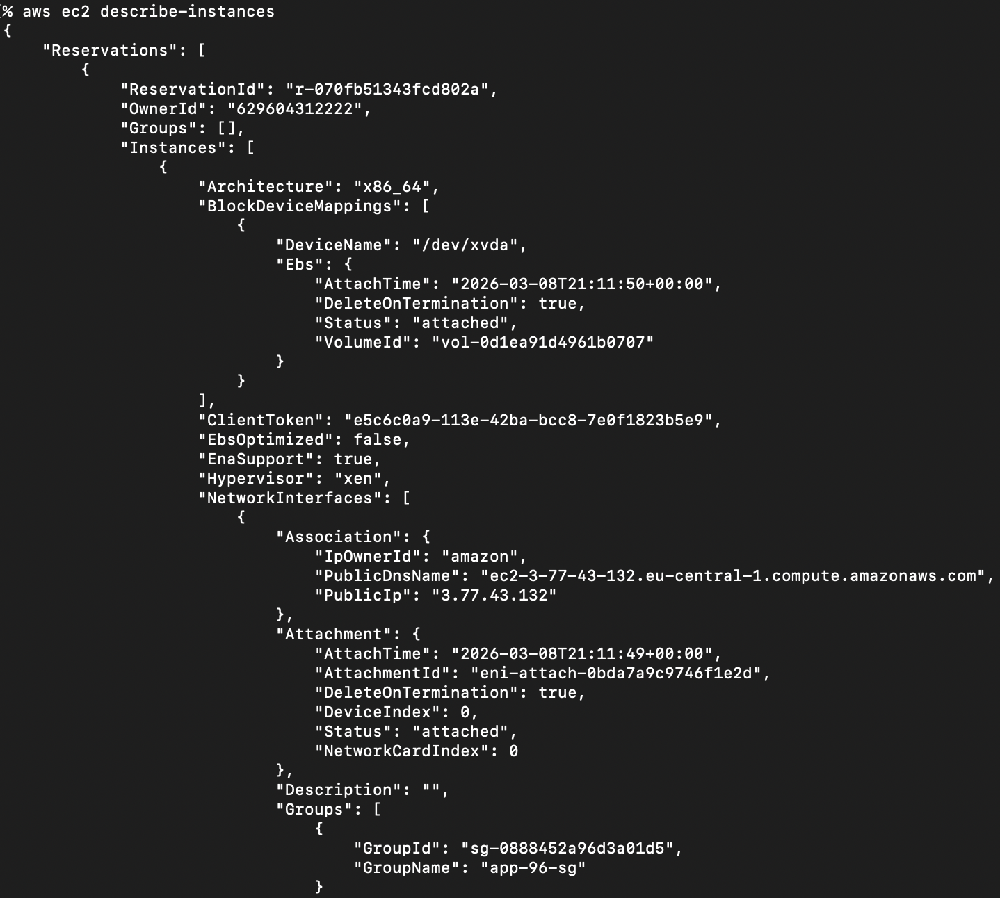

Verify that unauthorized operations are blocked:

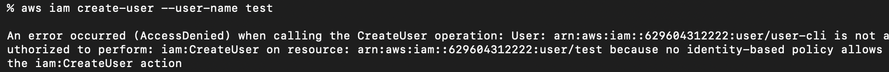

---

## 4. Clean Up

Run the following commands in order to remove all created resources. Replace all `<placeholders>` with your actual values.

1. **Terminate EC2 instance**
```sh
aws ec2 terminate-instances --instance-ids <INSTANCE_ID>
```

2. **Delete access keys for `user-cli`**
```sh
aws iam delete-access-key \
  --user-name user-cli \
  --access-key-id <ACCESS_KEY_ID> \
  --profile admin
```

3. **Delete login profile (console password) for `user-cli`**
```sh
aws iam delete-login-profile --user-name user-cli --profile admin
```

4. **Detach policies from the group**
```sh
aws iam detach-group-policy \
  --group-name group-cli \
  --policy-arn arn:aws:iam::aws:policy/AmazonEC2FullAccess \
  --profile admin

aws iam detach-group-policy \
  --group-name group-cli \
  --policy-arn <CHANGE_PASSWORD_POLICY_ARN> \
  --profile admin
```

5. **Delete the custom ChangePassword policy**
```sh
aws iam delete-policy --policy-arn <CHANGE_PASSWORD_POLICY_ARN> --profile admin
```

6. **Remove user from the group**
```sh
aws iam remove-user-from-group \
  --user-name user-cli \
  --group-name group-cli \
  --profile admin
```

7. **Delete user**
```sh
aws iam delete-user --user-name user-cli --profile admin
```

8. **Delete group**
```sh
aws iam delete-group --group-name group-cli --profile admin
```

9. **Delete key pair**
```sh
aws ec2 delete-key-pair --key-name app-96-key --profile admin
```

10. **Delete security group**
```sh
aws ec2 delete-security-group --group-id <YOUR_SECURITY_GROUP_ID> --profile admin
```
